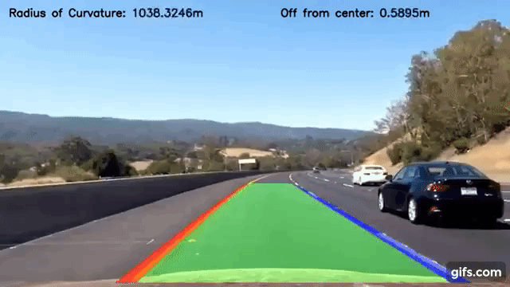
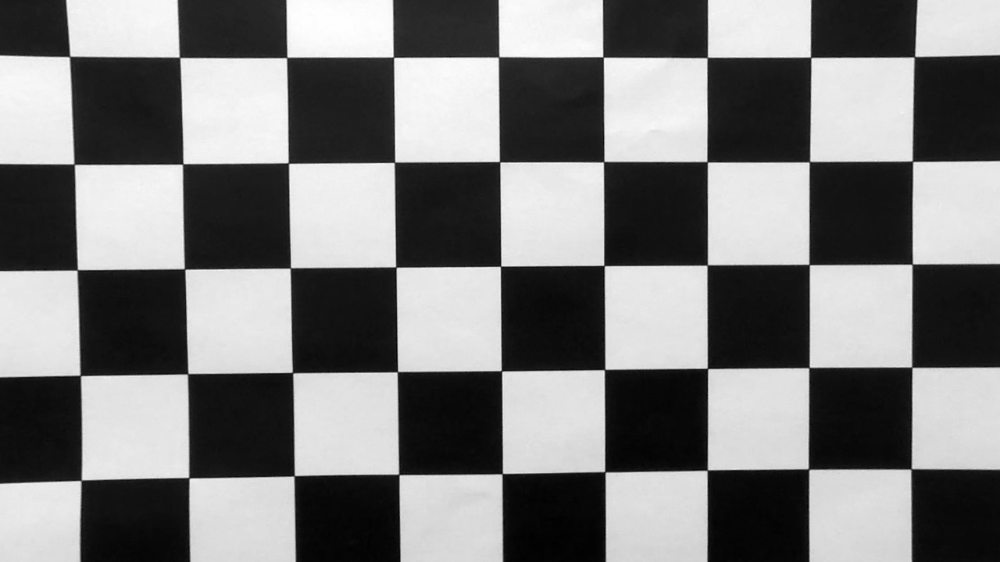
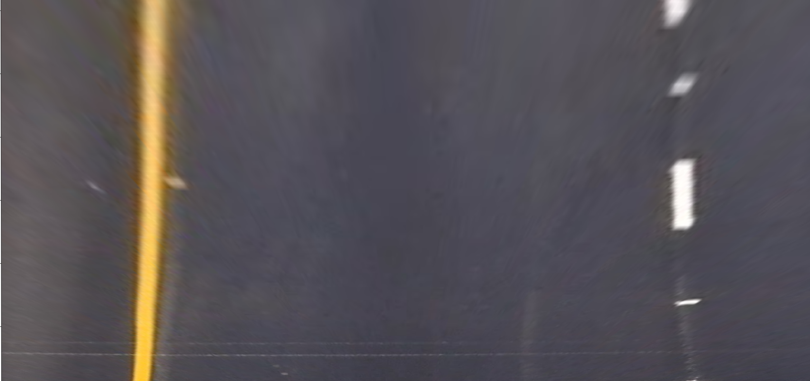

## Writeup Template

### You can use this file as a template for your writeup if you want to submit it as a markdown file, but feel free to use some other method and submit a pdf if you prefer.
[//]: # (Image References)

[image1]: ./examples/undistort_output.png "Undistorted Image"
[image2]: ./output_images/test1_output.jpg "Road Transformed"
[image3]: ./output_images/straight_lines1_binarized.jpg "Binary Example"
[image4]: ./examples/warped_straight_lines.jpg "Warp Example"
[image5]: ./examples/color_fit_lines.jpg "Fit Visual"
[image6]: ./output_images/straight_lines1.jpg "Output"
[video1]: ./project_video.mp4 "Video"

---

**Advanced Lane Finding Project**

<p align="center">
 <a href="https://www.youtube.com/watch?v=BpPxaQ21FKg"></a>
 <br>Results
</p>

The goals / steps of this project are the following:

* Calculate camera calibration and distortion matrix coeff for given chessboard images
* Undistort the raw images with above found matrices
* Apply color filters, thresholds, gradients to create a thresholded binary image
* Warp the image to get the bird's eye view
* Find the lane line pixels for left and right lanes
* Fit the lane boundary
* Find radius of curvature for lanes individually and calculate their mean for putting on the output frame
* Warp back the previously warped image on the original image to get the overlay of found lanesehicle position.

---

### Camera Calibration

#### 1. Briefly state how you computed the camera matrix and distortion coefficients. Provide an example of a distortion corrected calibration image.
To calibrate the camera, I took below steps
* List all the files present in the given chessboard image dir
* Taking each image one-by-one, find the chessboard corners (Chessboard used is 9x6) using openCv's `findChessboardCorners()` method
* This gave me the list of corners detected which were appended in a list for later use
* Using these corners, I calibrated the camera with openCv's `calibrateCamera()` method which gave me
  > Camera calibration matrix (`mtx`) and distortion matrix (`dist`)
  
  > Rotational vectors (`rvecs`) and translational vectors (`tvecs`)
* Using the `mtx` and `dist` matrices, I undistorted the distorted image using openCv's `undistort()` method
* Below is the exaple of distorted image converted to undistorted image

<p>
 Original
 Undistorted
<br>
</p>

### Pipeline (single images)

#### 1. Provide an example of a distortion-corrected image.

For correction of distortion, I used the same `mtx` and `dist` matrices calculated in previous step. With these matrices, and using openCv's `undistort()` method, I corrected the distortion.
![alt text][image2]

#### 2. Describe how (and identify where in your code) you used color transforms, gradients or other methods to create a thresholded binary image.  Provide an example of a binary image result.

After correction of distortion, I derived a binary thresholded image with `binarize_util.binarize()` method. With the application of `Sobel()` calcuation, I could find the lanes in y and x direction respectively and calculated its magnitude.
After this, applied a threshold on this image and whichever pixels fall between threshold values were made hot, rest were 0.

![alt text][image3]

#### 3. Describe how (and identify where in your code) you performed a perspective transform and provide an example of a transformed image.

For changing the perspective, openCv gives a method `getPerspectiveTransform()` which returns a matrix for changing the perspective from `src` to 'dst'. `src` and `dst` are the source and destination points for an image part of which want to change the perspective.

These points were calculated with some trial and error method and found to be as 

```python
src = np.float32(
    [[(img_size[0] / 2) - 55, img_size[1] / 2 + 100],
    [((img_size[0] / 6) - 10), img_size[1]],
    [(img_size[0] * 5 / 6) + 60, img_size[1]],
    [(img_size[0] / 2 + 55), img_size[1] / 2 + 100]])
dst = np.float32(
    [[(img_size[0] / 4), 0],
    [(img_size[0] / 4), img_size[1]],
    [(img_size[0] * 3 / 4), img_size[1]],
    [(img_size[0] * 3 / 4), 0]])
```
In the file `warp_perspective` one can see how we calculated `M` and `Minv` matrices.
* `M` matrix is for changig the perspective
* `Minv` is for reversing the changed perspective

Using this `M` and openCv's `warpPerspective()` method, a bird's eye view can be calculated.
The `Minv` matrix will be used when we map the found lanes on the actual image/frame.

<p>
 Original
 Warped
<br>
</p>

#### 4. Describe how (and identify where in your code) you identified lane-line pixels and fit their positions with a polynomial?

A second order polynomial was calculated to fit in. One can find the code in `line.py`.
Please see below image.

![alt text][image5]

#### 5. Describe how (and identify where in your code) you calculated the radius of curvature of the lane and the position of the vehicle with respect to center.

Finding radius of curvature, I took the approach mentioned in [this awesome tutorial](http://www.intmath.com/applications-differentiation/8-radius-curvature.php)

#### 6. Provide an example image of your result plotted back down onto the road such that the lane area is identified clearly.

This can be seen under `line.drawOnRoad()` method.
![alt text][image6]

---

### Pipeline (video)

#### 1. Provide a link to your final video output.  Your pipeline should perform reasonably well on the entire project video (wobbly lines are ok but no catastrophic failures that would cause the car to drive off the road!).

Here's a [link to my video result](https://www.youtube.com/watch?v=BpPxaQ21FKg)

---

### Discussion

#### 1. Briefly discuss any problems / issues you faced in your implementation of this project.  Where will your pipeline likely fail?  What could you do to make it more robust?

* I faced the issues regarding finding the exact ROI. Had to do a lot of trial and error to find exact locations.
* I faced issues for the changing road conditions/pavements colors
* For such issues, I had to tune the binary threshold values (now set to 200-255 range) and margin (now set to 30 pixels). Margin is the number of pixels to look left and right of previously found lane.
* Pipeline might fail in case of changing lanes conditions.
* Pipeline might fail in case of changing road conditions like tar road to cement concrete road case.
